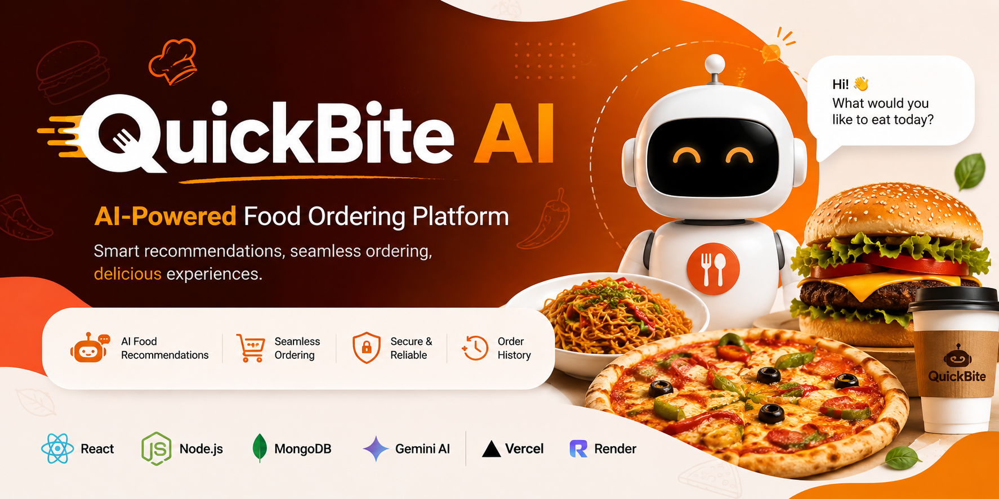
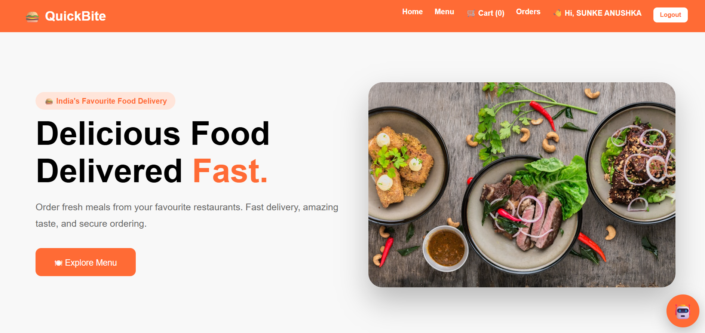
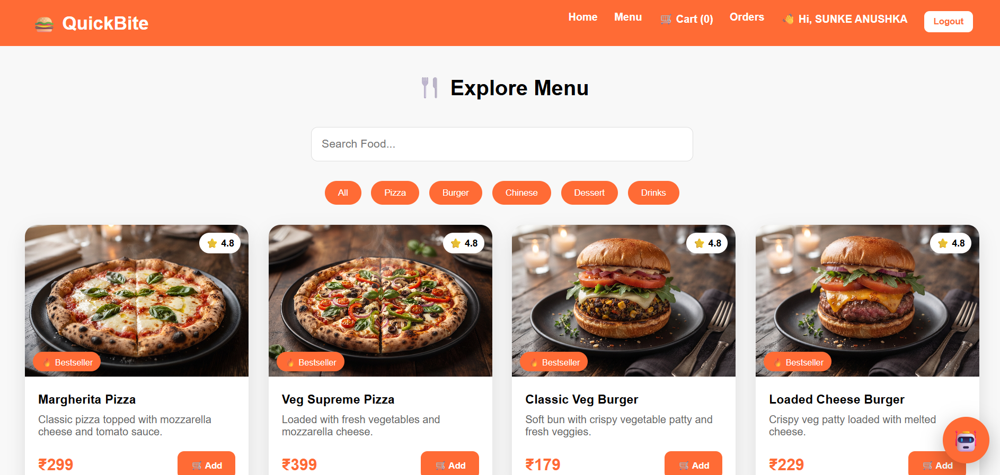
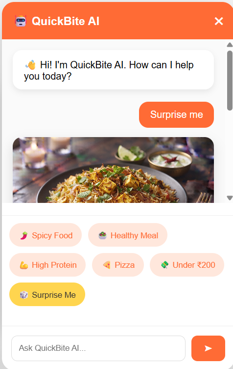
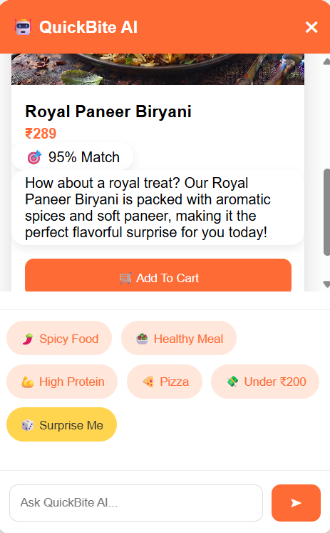
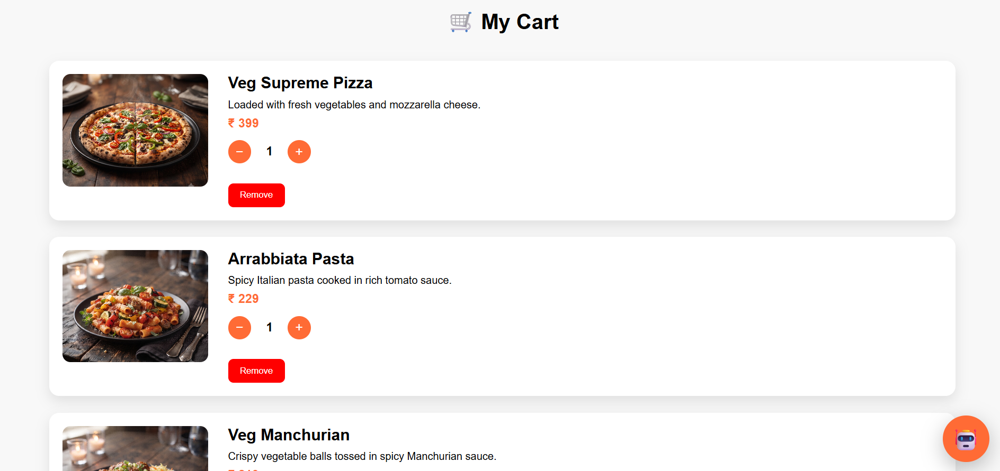
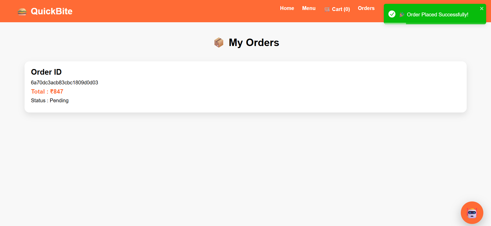

<p align="center">
  
</p>

<h1 align="center">QuickBite AI</h1>

<p align="center">
  <strong>AI-Powered Food Ordering Platform built using the MERN Stack and Google Gemini AI.</strong>
</p>

<p align="center">
  <a href="https://quick-bite-taupe-nine.vercel.app"><strong>Live Demo</strong></a>
  •
  <a href="https://quickbite-api-3ptx.onrender.com"><strong>Backend API</strong></a>
</p>

<p align="center">
  
  
  
  
  
  
</p>

---

# Overview

QuickBite AI is a full-stack AI-powered food ordering platform that combines the MERN stack with Google Gemini AI to provide an intelligent and personalized food ordering experience.

The application allows users to browse food items, search and filter menus, manage shopping carts, place orders, and interact with an AI assistant that recommends meals based on user preferences, cuisine, budget, and conversational context.

---

# Features

## Authentication

- User Registration
- User Login
- JWT Authentication
- Protected Routes

## Food Ordering

- Browse Food Menu
- Search Food Items
- Category Filtering
- Add to Cart
- Remove from Cart
- Place Orders
- View Order History

## AI Recommendation System

- Personalized food recommendations using Google Gemini AI
- Context-aware conversations
- Budget-based meal suggestions
- Cuisine-based recommendations
- Surprise Me feature
- AI confidence score
- Add AI-recommended food directly to the shopping cart

## User Experience

- Responsive Design
- Floating AI Assistant
- Interactive Food Cards
- Toast Notifications
- Modern User Interface

---

# Tech Stack

| Category | Technologies |
|----------|--------------|
| Frontend | React.js, React Router DOM, Axios, CSS, React Toastify |
| Backend | Node.js, Express.js |
| Database | MongoDB Atlas, Mongoose |
| Authentication | JWT, Bcrypt.js |
| Artificial Intelligence | Google Gemini API |
| Deployment | Vercel, Render |

---

# Project Structure

```text
QuickBite
│
├── client
│   ├── public
│   ├── src
│   │   ├── assets
│   │   ├── components
│   │   ├── context
│   │   ├── pages
│   │   ├── services
│   │   └── styles
│   └── package.json
│
├── server
│   ├── config
│   ├── controllers
│   ├── middleware
│   ├── models
│   ├── routes
│   ├── seed
│   ├── server.js
│   └── package.json
│
├── screenshots
│   ├── banner.png
│   ├── home.png
│   ├── menu.png
│   ├── ai-chat.png
│   ├── ai-recommendation.png
│   ├── cart.png
│   └── orders.png
│
└── README.md
```

---

# Application Screenshots

## Home Page



---

## Explore Menu



---

## AI Assistant

The AI assistant interacts with users through natural conversations and understands their food preferences.



---

## AI Recommendation

The AI recommends meals with a confidence score, explanation, and allows users to add the recommendation directly to their cart.



---

## Shopping Cart

Users can manage selected food items and review their order before checkout.



---

## Order History

Users can access all previously placed orders from their account.



---

# Installation

## Clone the Repository

```bash
git clone https://github.com/Bhagya1404/QuickBite.git
```

## Backend Setup

```bash
cd server
npm install
npm start
```

## Frontend Setup

```bash
cd client
npm install
npm run dev
```

---

# Environment Variables

Create a `.env` file inside the `server` directory.

```env
PORT=5000

MONGO_URI=your_mongodb_connection_string

JWT_SECRET=your_jwt_secret

GEMINI_API_KEY=your_google_gemini_api_key
```

---

# Future Enhancements

- Wishlist
- Online Payment Integration
- Food Reviews and Ratings
- Live Order Tracking
- Dark Mode
- Progressive Web App (PWA)
- Personalized AI recommendations using order history

---

# Author

**BHAGYA SREE**

- GitHub: https://github.com/Bhagya1404

---

# License

This project is developed for educational and portfolio purposes.
